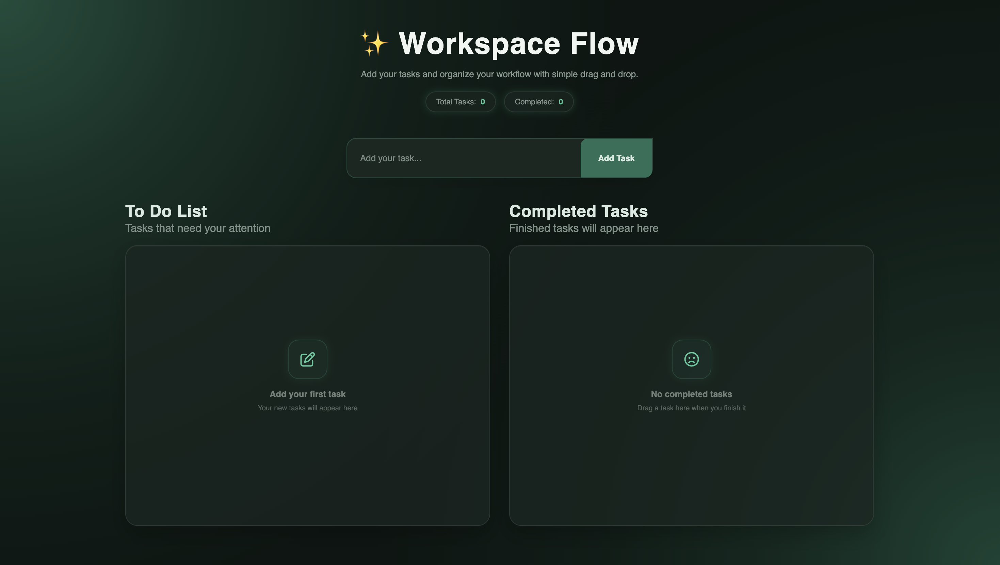

# Task Management App

A simple task management app where users can add their daily tasks, move completed tasks with drag and drop, and keep their tasks saved in the browser.

The main goal of this project was to practice DOM manipulation, Drag and Drop, Local Storage, and dynamic UI updates using Vanilla JavaScript.

## 🌐 Live Demo

- **Live Link:** [Live-Link](https://tonmoyislam-deventest.github.io/task-management/)

## 📸 Preview

  

## ✨ Features

- **Add Tasks:** Users can add their daily tasks from the input field.
- **Task Animation:** New tasks are added to the task area with a smooth UI animation.
- **Drag & Drop:** Users can drag a task from the To-Do area to the Completed area.
- **Live Task Count:** Shows the current number of total and completed tasks.
- **Delete Tasks:** Users can delete tasks from the list.
- **Local Storage:** Tasks are saved in the browser and stay available after a page reload.
- **Empty State:** Shows a message when there are no tasks in a section.

## 🧠 Key Functionality

- Tasks are stored as objects with completed status.
- The UI and Local Storage stay synced when tasks are added, deleted, or moved.
- Drag and Drop events update the task status between To-Do and Completed.
- Task counts and empty messages update automatically when the task list changes.

## 🛠️ Technologies Used

- **HTML5:** For the basic structure.
- **CSS3:** For the UI design, gradients, animations, and responsive layout.
- **Vanilla JavaScript:** For DOM manipulation, Drag and Drop, Local Storage, and dynamic updates.

## 💡 What I Learned

### CSS

- How to create a clean and attractive UI using CSS.
- How to use gradients and choose better color combinations.
- How to create animations and visual effects with CSS.
- How to build a responsive layout.

### JavaScript

- How to work with Drag and Drop event listeners.
- How to save data in Local Storage.
- How to load saved tasks after a browser reload.
- How to keep the UI and Local Storage data synchronized.
- How to update task counts dynamically.
- How to create, remove, and update DOM elements with JavaScript.

## 🐛 Challenges & Solutions

### 1. Keeping UI and Local Storage in Sync

One challenge was keeping the UI and Local Storage data synchronized.
For example, when a task is deleted, it should be removed from both the UI and Local Storage.

**Solution:**  
I updated the task array and saved the updated data back to Local Storage whenever a task was added or deleted.

### 2. Updating Task Status with Drag & Drop

Another challenge was updating the task status when a task was moved between To-Do and Completed.

**Solution:**  
I used Drag and Drop events to detect the target drop area and updated the `completed` status in Local Storage.

### 3. Keeping the Task Count Updated

It was also challenging to keep the total and completed task counts updated after every action.

**Solution:**  
I created a function that checks the current tasks in both sections and updates the counts whenever the task list changes.

## 🚀 Getting Started

1. Clone the repository.
2. Open the project folder.
3. Open `index.html` in your browser or use a local development server.
4. Start adding and managing your tasks.

No extra packages or installation are required.

## 📬 Contact

- **GitHub:** [GitHub-Profile](https://github.com/tonmoyislam-deventest)
- **LinkedIn:** [LinkedIn-Profile](https://www.linkedin.com/in/tonmoy-islam12/)
